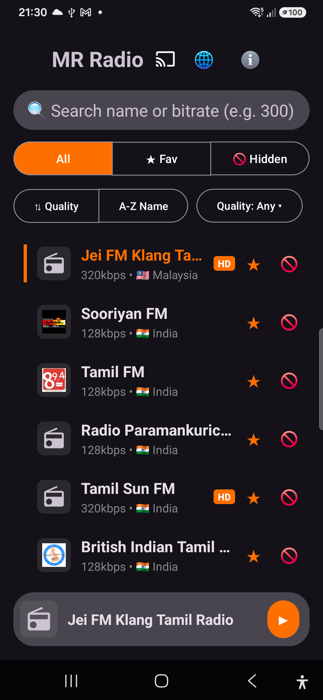
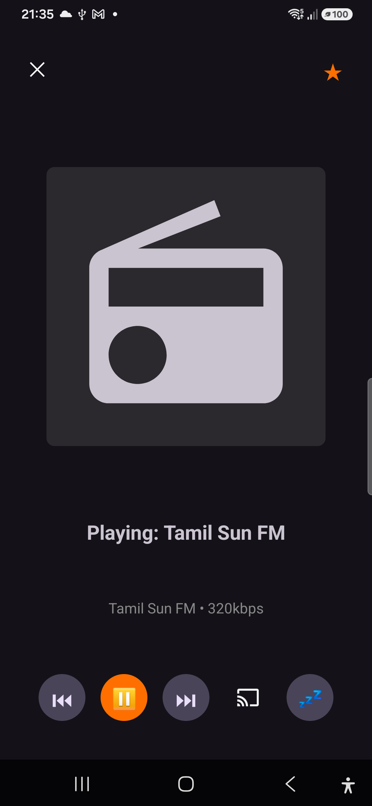
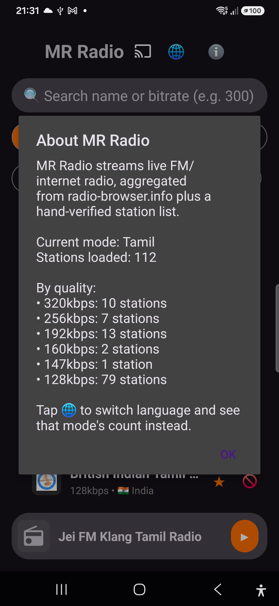

# MR Radio

An Android app that streams live FM/internet radio, aggregated from
[radio-browser.info](https://www.radio-browser.info/) plus a hand-verified station list.
Switch between Tamil and English station libraries, browse from a full-height list, and
control playback from a mini-player, a full-screen Now Playing view, the system
notification, lock screen, Chromecast, or Android Auto — all backed by the same
`MediaLibraryService` so every surface stays in sync.

## Screenshots

| Station list | Now Playing | About / station stats |
|---|---|---|
|  |  |  |

## Features

- **Language mode** — pick Tamil or English the first time the app launches; switch
  anytime via the 🌐 icon. Both the phone UI and the background playback service
  re-fetch independently so native prev/next, the notification, and Android Auto never
  fall out of sync with what's on screen.
- **Station discovery** — merges three radio-browser.info queries (by language, by name,
  by tag) plus the hand-curated list, so stations with incomplete metadata still show
  up. Deduplicates mirrors/relays that point at the same stream, filters out sub-128kbps
  junk, and cleans up slug-style names (`tamilrockyfm` → `Tamil Rocky FM`).
- **Reachability check** — dead streams are detected in the background (never blocks the
  UI) and auto-hidden, with a rate-limit guard so a transient network blip can't
  mass-hide the whole list.
- **Mini-player + full-screen Now Playing** — a slim bar above the list shows what's
  playing without getting in the way of browsing; tap it to expand into a full-screen
  player with artwork, favorite toggle, and every control (prev/play/next/cast/sleep).
- **Station logos, quality badges, live-verified badges, country flags** — each row shows
  the station's artwork, an "HD" badge at ≥320kbps, a green "LIVE" badge for
  hand-verified entries, and a flag emoji for its country.
- **Sort & quality filter** — sort the current list by quality or name, or filter to a
  minimum bitrate tier built from whatever's actually in the loaded list (not a fixed
  guess).
- **Favorites / Hidden lists** — star a station to favorite it, or hide ones you don't
  want cluttering the list; both persist across restarts and are reachable from three
  tabs (All / Favorites / Hidden) in the app and mirrored as browse folders in Android
  Auto. Favorites tab is the default view on launch.
- **Search** — type a name to filter, or type a plain number (e.g. `300`) to filter by
  minimum bitrate.
- **Info dialog** — the ℹ️ icon shows a live breakdown of how many stations are loaded
  for the current language, by bitrate tier.
- **Notification & lock screen controls** — play/pause/prev/next plus a favorite-toggle
  button, backed by a real `MediaLibraryService` so the playlist is shared across every
  surface (phone UI, notification, lock screen, Android Auto).
- **Chromecast** — casting loads a real queue on the receiver (not a single stream), so
  native skip and Assistant ("Hey Google, next") work; casting gets its own system
  notification, and hardware volume keys control the Cast device's volume instead of the
  phone's.
- **Android Auto** — full browse tree (All / Favorites / Hidden folders), native
  previous/next, and the same favorite button on the now-playing screen.
- **Sleep timer** — stop playback automatically after a chosen interval.

## Build

```bash
./gradlew assembleDebug
```

## Install

```bash
adb install -r app/build/outputs/apk/debug/app-debug.apk
```

A prebuilt debug APK is also kept up to date at
[`releases/mr-radio-debug.apk`](releases/mr-radio-debug.apk).

## Project layout

| File | Responsibility |
|---|---|
| `MainActivity.kt` | UI: station list, search/filter/sort, mini-player, full-screen Now Playing, language picker, info dialog, Cast session handling |
| `RadioPlaybackService.kt` | `MediaLibraryService` - owns the ExoPlayer instance and playlist (single source of truth for playback across all surfaces), Android Auto browse tree, notification favorite button, re-fetches on language change |
| `RadioBrowserApi.kt` | Retrofit client for radio-browser.info, merges multiple queries per language |
| `StationUtils.kt` | Dedup, name prettification, reachability filtering |
| `CustomStations.kt` | Hand-curated, individually verified stations whose registered API stream URL is dead but whose own site serves a working one |
| `LanguagePrefs.kt` | Persists the selected station language (Tamil/English) |
| `CountryFlags.kt` | Maps a station's country string to a flag emoji |
| `FavoritesStore.kt` / `HiddenStore.kt` | SharedPreferences-backed persistence |
| `CastOptionsProvider.kt` | Cast SDK setup - notification/expanded-controller options for casting |
| `StationAdapter.kt` / `item_station.xml` | RecyclerView list row (logo, name, quality/live badges, favorite star, hide button, now-playing highlight) |

## Notes

- Streams are aggregated from public radio-browser.info listings and individually
  verified custom entries, not hosted by this app.
- See `CLAUDE.md` for architecture details and gotchas relevant to making further changes.
